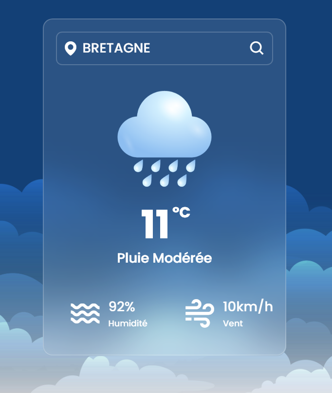

# Application Météo

Une application météo simple et intuitive qui fournit les prévisions météorologiques pour n'importe quelle ville (ou région) dans le monde. Alimentée par une API, cette application vous permet de rechercher des villes et d'obtenir instantanément les informations météorologiques actuelles ainsi que les prévisions à venir.

## Fonctionnalités

- **Recherche de Ville**: Entrez le nom de n'importe quelle ville pour obtenir les prévisions météorologiques.
- **Informations Détaillées**: Consultez les détails météorologiques précisément, y compris la température, l'humidité, la vitesse du vent et plus encore.
- **Mises à Jour en Temps Réel**: Les données météorologiques sont actualisées en temps réel pour vous fournir des informations météorologiques précises.
- **Convivialité**: Interface utilisateur simple et conviviale pour une expérience utilisateur optimale.

## Comment Utiliser

1. Clonez ce dépôt sur votre machine locale.
2. Ouvrez `index.html` dans votre navigateur web préféré.
3. Saisissez le nom de la ville dans le champ de recherche et appuyez sur Entrée ou cliquez sur le bouton Rechercher.
4. Explorez les prévisions météorologiques pour la ville sélectionnée.

## Technologies Utilisées

- HTML
- CSS
- JavaScript
- API Météo

## Capture d'écran

  

<small><em>Voici la capture d'écran de l'application météo en action.</em></small>

